<!-- ── Live contribution heatmap — real data, boxes animate in on load ─────
     Refreshed daily by .github/workflows/update-profile-art.yml            -->

<h3><code>tarun@github ~ $ ./contributions.sh</code></h3>

  

<!-- ── ASCII portrait + neofetch info card ────────────────────────────────
     Regenerate portrait: python scripts/prep_photo.py <photo.jpg>
                          python scripts/make_ascii_svg.py
     Regenerate card:     python scripts/make_info_card.py               -->

<h3><code>tarun@github ~ $ whoami</code></h3>

<table>
  <tr>
    <td valign="top"></td>
    <td valign="top"></td>
  </tr>
</table>

  

<!-- ── Links ────────────────────────────────────────────────────────────── -->

<h3><code>tarun@github ~ $ ./links.sh</code></h3>

<b>Security Engineer · AI Builder · Full-Stack Dev</b>

 

